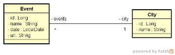

# Challenge Event City TDD

This project present a challenge to implement the necessary funcionalities to all the test passing

## Model Doamin

## Required

- DELETE /cities/{id} should return  404 Not Found when id does not exist

- DELETE /cities/{id} should return  204 No Content when id exists

- DELETE /cities/{id} should return  400 Bad Request when dependent id

- POST /cities should insert resource

- GET /cities should return resource order by name

- PUT /events should update resource when id exists

- PUT /events should return 404 Not Found when id does not exist

## Skils

- Rest API with Java and Spring Boot

- Implementation search, insertion, delete and update

- API Exceptions with custom requests HTTP 
